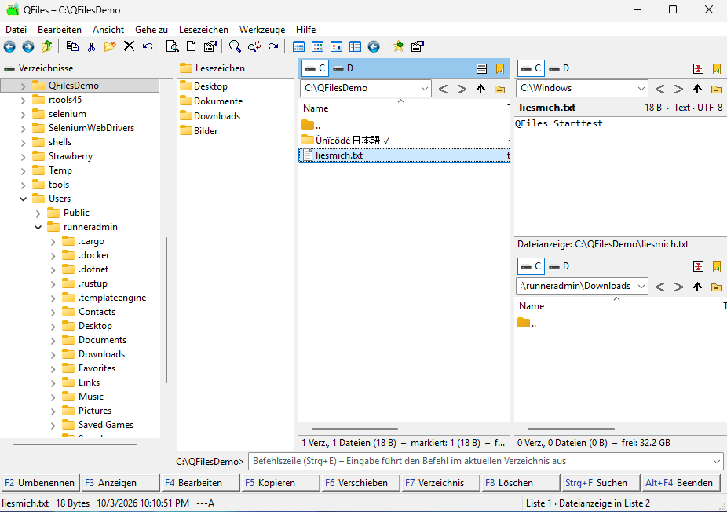

# QFiles

QFiles ist ein Dateimanager für Windows (64 Bit), nachempfunden **Idoswin Pro** (<https://www.idoswin.de/>).
Er ist in C++20 mit dem reinen Win32-API geschrieben: kein MFC, kein Qt, keine Fremdbibliotheken, eine einzige
`QFiles.exe` ohne Installation.

QFiles ist durchgehend Unicode-fähig. Dateinamen mit beliebigen Zeichen (Umlaute, Akzente, CJK, Emoji,
Surrogatpaare) werden korrekt angezeigt, umbenannt, kopiert und durchsucht. Lange Pfade über 260 Zeichen werden
ebenfalls unterstützt.



*Bildschirmfoto aus dem automatischen Starttest unter Windows Server 2025: links Verzeichnisbaum und Lesezeichen, Liste 1 mit Unicode-Verzeichnisnamen, rechts geteilte Spalte – oben die Dateianzeige der in Liste 1 gewählten Datei, unten Liste 4.*

---

## Abweichungen von Idoswin Pro

| Bereich | Umsetzung in QFiles |
|---|---|
| Name, Symbol | „QFiles“ mit eigenem Programmsymbol (`res/QFiles.ico`) |
| Unicode | Vollständig Unicode (UTF-16 intern), insbesondere Anzeige und Bearbeitung von Dateinamen |
| Texteditor | Neue und **leere Dateien werden standardmäßig als UTF-8 ohne BOM** gespeichert; vorhandene Dateien behalten ihre Kodierung |
| Disketten | Alle diskettenbezogenen Funktionen entfallen (keine Diskettenlaufwerke A:/B:, kein Formatieren/Kopieren von Disketten, keine Diskettengrößen beim Teilen) |
| Zwei Dateilisten | Immer **senkrecht nebeneinander**, Verzeichnisbaum links |
| Dateianzeige | Standardeinstellung „**in dem jeweils anderen Fenster**“ (Schnellansicht ersetzt die Gegenseite) |
| Kopfzeile jeder Liste | Laufwerksymbole, rechtsbündig **Split** und ganz rechts **Lesezeichen hinzufügen** |
| Lesezeichen | Als **senkrechte Liste zwischen Verzeichnisbaum und Dateilisten**, immer sichtbar (nicht abwählbar), statt im Kopfzeilenbereich |
| Split | Teilt eine Liste waagerecht: unten erscheint Liste 3 (links) bzw. Liste 4 (rechts) mit gleichem Kopfbereich |
| Einstellungen | Standardmäßig in `%ProgramData%\QFiles\QFiles.ini` |

### Lesezeichen-Symbol in der Kopfzeile

Ein Klick auf das Lesezeichen-Symbol (ganz rechts in der Kopfzeile jeder Liste, auch mit Strg+D) fügt das in
dieser Liste gewählte Verzeichnis der Lesezeichenliste hinzu:

- Es erscheint eine Abfrage nach dem Namen. Sie ist mit dem letzten Glied des Verzeichnisnamens vorbelegt
  (bei Laufwerken z. B. `D:`).
- Steht das Verzeichnis schon in der Lesezeichenliste, zeigt die Abfrage einen Hinweis mit dem vorhandenen Namen.
- „Abbrechen“ fügt nichts hinzu.
- Das neue Lesezeichen kommt ans **Ende** der Lesezeichenliste.

### Split-Funktion

- Das **Split-Symbol** in der Kopfzeile (oder Strg+T) teilt die Liste. Die untere Hälfte ist ein eigenes,
  vollwertiges Listenfenster: das „dritte“ (links) bzw. „vierte“ (rechts).
- Das untere Fenster hat denselben Kopfbereich: Laufwerksymbole, rechts Split- und Lesezeichensymbol, darunter das
  Verzeichnis-Textfeld mit Wahlsymbolen (Zurück, Vor, Übergeordnet, Verzeichnis wählen).
- Im oberen Fenster wird das Split-Symbol zum **Split-aufheben-Symbol**. Im unteren Fenster erscheint es nur so.
  Ein Klick in einem der beiden hebt die Teilung auf.
- Beide Spalten lassen sich unabhängig teilen. Bis zu vier Listen sind gleichzeitig sichtbar; die Teilerhöhe ist
  mit der Maus verschiebbar.

### Dateianzeige „in dem jeweils anderen Fenster“

F3 (oder Strg+Q) schaltet die Schnellansicht ein. Die jeweils andere Liste zeigt dann den Inhalt der Datei, auf
der in der aktiven Liste der Fokus steht. Die Anzeige folgt beim Blättern und lässt sich mit Esc beenden.

| Dateityp | Darstellung |
|---|---|
| Text | Kodierung wird automatisch erkannt |
| Bilder | über WIC |
| Binärdateien | hexadezimal |
| PDF, Office, HTML, RTF … | über die Windows-Vorschauhandler |
| Verzeichnisse | Übersicht |

Unter *Werkzeuge → Optionen → Dateianzeige* lässt sich stattdessen „in eigenem Fenster“ wählen.

---

## Funktionsumfang

### Oberfläche

- Verzeichnisbaum links. Er folgt der aktiven Liste; ein Klick öffnet das Verzeichnis in der aktiven Liste.
- Lesezeichenliste daneben:
  - Ein Klick öffnet das Lesezeichen in der aktiven Liste, Umschalt+Eingabe in der anderen.
  - Umbenennen mit F2, Entfernen mit Entf, Verschieben mit Alt+↑/↓, Pfad über das Kontextmenü ändern.
  - Dateien lassen sich auf ein Lesezeichen ziehen.
- Eine oder zwei Dateilisten (Strg+Umschalt+L), jede teilbar (Split). Die aktive Liste ist farbig markiert.
- Je Liste:
  - Laufwerksymbole: Ein Klick springt zum zuletzt besuchten Verzeichnis des Laufwerks; ein Rechtsklick öffnet das
    Kontextmenü des Laufwerks.
  - Verzeichnis-Textfeld mit Verlauf und Autovervollständigung; Umgebungsvariablen wie `%USERPROFILE%` sind erlaubt.
  - Zurück/Vor, Übergeordnet, Verzeichnis wählen.
  - Statuszeile: Anzahl, Größe, Markierung, Filter, freier Speicher.
- Ansichten: Details, Liste, Symbole, Miniaturansicht (über die Windows-Shell, Größe einstellbar).
- Sortieren nach Name, Typ, Größe, Datum oder Attributen, auf- und absteigend. Namen werden natürlich sortiert,
  wie im Explorer.
- Versteckte und Systemdateien ein-/ausblendbar. Dateifilter je Liste mit Ein- und Ausschlussmustern.
- Automatische Aktualisierung bei Änderungen im Dateisystem.
- Werkzeugleiste.
- Befehlszeile: führt Befehle im aktuellen Verzeichnis in einem Konsolenfenster aus. `cd` und `X:` wechseln das
  Verzeichnis der Liste. Mit Verlauf; Dateien lassen sich hineinziehen.
- Funktionstastenleiste. Bei gedrückter Strg- bzw. Strg+Umschalt-Taste zeigt sie die Belegung der programmierbaren
  Tasten.
- Statusleiste.

### Dateioperationen

- Kopieren (F5) und Verschieben (F6) in die andere Liste, Umbenennen direkt in der Liste (F2), neues Verzeichnis
  (F7), neue Textdatei (Umschalt+F4), Löschen in den Papierkorb (Entf/F8) oder endgültig (Umschalt+Entf).
- Ausführung über die Windows-Shell (`IFileOperation`): Fortschrittsanzeige, Konfliktdialoge, Rechteerhöhung.
- **Rückgängig** (Strg+Z) für Kopieren, Verschieben, Umbenennen und Anlegen.
- Drag & Drop zwischen Listen, Baum, Lesezeichen und anderen Programmen. Rechte Maustaste fragt nach Kopieren oder
  Verschieben.
- Zwischenablage: Ausschneiden, Kopieren, Einfügen, kompatibel mit dem Explorer.
- Explorer-Kontextmenü, „Öffnen mit“, Eigenschaften (Alt+Eingabe).
- Attribute und Zeitstempel ändern, auch rekursiv. Das Datum lässt sich aus dem EXIF-Aufnahmedatum übernehmen.
- Verzeichnisgrößen berechnen (Leertaste auf einem Verzeichnis oder Alt+Umschalt+Eingabe für alle).

### Werkzeuge

| Werkzeug | Funktion |
|---|---|
| Dateigruppe umbenennen (Strg+M) | Masken mit Platzhaltern (siehe unten), Zähler, Suchen/Ersetzen (auch regulärer Ausdruck), Groß-/Kleinschreibung, Unterverzeichnisse, Live-Vorschau mit Konfliktprüfung; ein Rückgängig-Schritt |
| Dateien suchen (Strg+F) | Name, Text in UTF-8/UTF-16/ANSI, Größe, Datum, Attribute; Ergebnisliste mit „Gehe zu“ |
| Doppelte Dateien | Gleicher Inhalt: Größe, dann Hash, dann byteweiser Vergleich |
| Dateien vergleichen (Strg+K) | Text zeilenweise nebeneinander mit Farbmarkierung und zeichengenauer Hervorhebung; Binärvergleich |
| Verzeichnisse vergleichen (Strg+Umschalt+K) | Markiert gleiche, unterschiedliche, neuere und fehlende Dateien farbig und wählt sie zum Kopieren aus |
| Verzeichnisse synchronisieren (Strg+Umschalt+Y) | In eine oder beide Richtungen, mit Vorschau, Filter, Spiegeln |
| Datei teilen / zusammenfügen | Mit CRC-Prüfsumme und Batchdatei zum Zusammenfügen ohne QFiles |
| Archive | ZIP anzeigen, entpacken und erstellen (Windows-Shell); 7z, RAR, TAR, CAB, ISO u. a. anzeigen und entpacken über das Windows-eigene `tar.exe` |
| Laufwerksübersicht | Belegung aller Laufwerke |
| Dateisystemmonitor | Protokoll aller von QFiles ausgeführten Dateioperationen |
| Verzeichnisliste | Drucken, als Textdatei speichern oder in die Zwischenablage, wahlweise mit Unterverzeichnissen |
| Spezielle Verzeichnisse | Desktop, Dokumente, Downloads, AppData, Startmenü u. a. |

### Programmierbare Funktionstasten

QFiles hat 24 programmierbare Funktionstasten: **Strg+F1 … F12** und **Strg+Umschalt+F1 … F12**. Belegt werden sie
unter *Werkzeuge → Funktionstasten belegen*. Eine Taste kann ein Programm, ein Dokument, eine URL oder einen
Konsolenbefehl starten.

Platzhalter in Parametern und Arbeitsverzeichnis:

| Platzhalter | Bedeutung |
|---|---|
| `%P` | aktuelles Verzeichnis |
| `%O` | Verzeichnis der Gegenseite |
| `%F` | Fokusdatei mit Pfad |
| `%N` | Name der Fokusdatei |
| `%E` | Name ohne Erweiterung |
| `%S` | markierte Dateien mit Pfad |
| `%M` | markierte Namen |
| `%L` | Listendatei (UTF-8) |
| `%%` | Prozentzeichen |

### Integrierter Texteditor (F4)

- RichEdit im Klartextmodus, beliebig viele Fenster.
- Kodierungen: UTF-8 (Standard für neue und leere Dateien, ohne BOM), UTF-8 mit BOM, UTF-16 LE/BE, ANSI, OEM.
- Zeilenenden CRLF, LF und CR; beim Speichern wählbar.
- Suchen, Ersetzen, Gehe zu Zeile.
- **Zeilen sortieren** (auf-/absteigend, ohne Groß-/Kleinschreibung, natürlich), doppelte Zeilen entfernen,
  Groß-/Kleinschreibung umwandeln, Tabulatoren und Leerzeichen umwandeln.
- Drucken.
- Meldet, wenn die Datei außerhalb des Editors geändert wurde.

### Anzeige und Hex-Editor

- Anzeigefenster (Umschalt+F3) für Text, Bilder (Zoom), Hex und Vorschauhandler; blättert durch die Dateien des
  Verzeichnisses.
- Hex-Editor (Alt+F3) für beliebig große Dateien. Er arbeitet im Überschreibmodus, hebt Änderungen hervor, hat
  Rückgängig und kann suchen (Hex/Text) sowie zu einem Offset springen.

### Platzhalter beim Umbenennen von Dateigruppen

| Platzhalter | Bedeutung |
|---|---|
| `[N]` | Name ohne Erweiterung |
| `[N3]` | 3. Zeichen |
| `[N2-5]` | Zeichen 2 bis 5 |
| `[N2-]` | ab dem 2. Zeichen |
| `[N-3]` | die letzten 3 Zeichen |
| `[N2,4]` | 4 Zeichen ab dem 2. |
| `[E]` | Erweiterung (Bereiche wie bei `[N]`) |
| `[C]` | Zähler (Start, Schritt, Stellen einstellbar) |
| `[D]` | Änderungsdatum JJJJMMTT |
| `[T]` | Uhrzeit hhmmss |
| `[P]` | Name des Elternverzeichnisses |
| `[[`, `]]` | eckige Klammern |

---

## Tastenkürzel (Auswahl)

| Taste | Funktion |
|---|---|
| Eingabe / Rücktaste | Öffnen / übergeordnetes Verzeichnis |
| Tab, Strg+1…4 | Nächste Liste, Liste 1…4 |
| F2 · F3 · F4 | Umbenennen · Anzeigen · Bearbeiten |
| F5 · F6 · F7 · F8/Entf | Kopieren · Verschieben · Neues Verzeichnis · Löschen |
| Umschalt+F3 · Alt+F3 · Umschalt+F4 | Anzeigefenster · Hex-Editor · Neue Textdatei |
| Strg+T | Split / Split aufheben |
| Strg+Q | Dateianzeige im anderen Fenster |
| Strg+D | Gewähltes Verzeichnis den Lesezeichen hinzufügen |
| Strg+Z | Rückgängig |
| Strg+F · Strg+K · Strg+Umschalt+K | Suchen · Dateien vergleichen · Verzeichnisse vergleichen |
| Strg+L / Strg+G · Strg+E | Verzeichnis eingeben · Befehlszeile |
| Alt+F1 · Alt+F2 | Verzeichnisbaum · Lesezeichenliste |
| Leertaste / Einfg · Num+ / Num− / Num* | Markieren · Gruppe markieren / abwählen / umkehren |
| F1 | Vollständige Übersicht aller Tastenkürzel |

---

## Einstellungen

Gespeichert werden:

- alle Optionen,
- Fensterposition und -größe,
- Breiten von Baum und Lesezeichenliste,
- Teilungsverhältnisse und Split-Zustand,
- die zuletzt in den **vier Listenfenstern** angezeigten Verzeichnisse mit Ansicht, Sortierung, Spaltenbreiten,
  Filter und Verlauf,
- die Lesezeichen,
- die Funktionstasten,
- der Befehlszeilen-Verlauf.

Speicherort:

1. **Standard:** `%ProgramData%\QFiles\QFiles.ini` (z. B. `C:\ProgramData\QFiles\QFiles.ini`), Textdatei in UTF-8.
2. Portabel: Liegt eine `QFiles.ini` neben der `QFiles.exe`, wird diese verwendet.
3. Befehlszeile: `QFiles.exe /ini="D:\Pfad\eigene.ini"`.

Weitere Befehlszeilenargumente: `QFiles.exe [Verzeichnis Liste 1] [Verzeichnis Liste 2]`.

---

## Bauen

Voraussetzung: CMake ≥ 3.20 und Visual Studio 2022 (MSVC, x64) oder MinGW-w64 (gcc ≥ 13).

```bat
cmake -S . -B build -G "Visual Studio 17 2022" -A x64
cmake --build build --config Release
build\Release\QFilesTests.exe
```

Cross-Build unter Linux mit MinGW-w64:

```sh
cmake -S . -B build -DCMAKE_TOOLCHAIN_FILE=cmake/mingw-w64-x86_64.cmake -DCMAKE_BUILD_TYPE=Release
cmake --build build
```

GitHub Actions (`.github/workflows/build.yml`) baut bei jedem Push mit MSVC und MinGW. Auf Windows laufen dabei die
automatischen Tests (Kodierungen, Einstellungsdatei, Dateioperationen mit Unicode-Namen und langen Pfaden) und ein
Starttest mit Bildschirmfoto. Wird auf GitHub ein Release veröffentlicht, hängt der Workflow `QFiles.exe` und `QFiles-x64.zip` an.

### Aufbau des Quelltexts

| Datei | Inhalt |
|---|---|
| `src/main.cpp`, `MainWindow.*` | Hauptfenster, Layout, Menüs, Befehle, Tastenkürzel, Befehlszeile, Funktionstastenleiste |
| `src/FilePane.*` | Listenfenster mit Kopfzeile (Laufwerke, Split, Lesezeichen), Pfadzeile, virtueller ListView, Schnellansicht |
| `src/DirTree.*`, `BookmarkList.*` | Verzeichnisbaum, Lesezeichenliste |
| `src/FileOps.*`, `ShellMenu.*` | Dateioperationen mit Rückgängig, Zwischenablage, Kontextmenü, Drag & Drop |
| `src/Settings.*`, `App.*` | Einstellungsdatei, Optionen, globale Dienste, Dateisystemmonitor |
| `src/Util.*`, `Encoding.*`, `Dialog.*`, `Glyphs.*` | Hilfsfunktionen, Textkodierungen, Dialoge ohne Ressourcendatei, Symbole |
| `src/TextEditor.*` | Texteditor |
| `src/Viewer.cpp`, `HexView.*` | Anzeige, Hex-Editor |
| `src/Compare*.cpp`, `SyncDirs.cpp` | Datei- und Verzeichnisvergleich, Synchronisieren |
| `src/BatchRename.cpp`, `FindFiles.cpp`, `Duplicates.cpp`, `SplitJoin.cpp` | Umbenennen, Suchen, Doppelte, Teilen |
| `src/Tools.cpp`, `Attributes.cpp`, `FunctionKeys.cpp`, `Archive.cpp`, `PrintList.cpp`, `OptionsDialog.cpp` | Weitere Werkzeuge und Optionen |

---

## Bekannte Einschränkungen

- Der Hex-Editor arbeitet nur im Überschreibmodus (kein Einfügen/Löschen von Bytes).
- ACE-Archive werden nicht unterstützt. RAR, 7z und andere Formate lassen sich nur anzeigen und entpacken, und nur
  soweit `tar.exe` (ab Windows 10 1803) sie kennt. Dabei können Namen außerhalb der Systemcodepage in der
  Listenansicht verfälscht werden; „Alles entpacken“ ist davon nicht betroffen.
- Netzwerkfreigaben werden über UNC-Pfade (`\\Server\Freigabe`) im Verzeichnis-Textfeld geöffnet; einen eigenen
  Netzwerk-Browser im Baum gibt es nicht.
- Die Oberfläche ist deutsch; eine Sprachumschaltung gibt es nicht.
